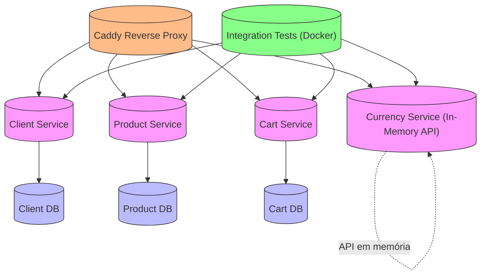

# 🚀 MEU TCC - Sistema de Serviços
**Plataforma Impact**

---

Projeto desenvolvido como **TCC da Plataforma Impact**, simulando um ambiente real de empresa, com **serviços independentes**, **APIs REST**, **logs**, **testes** e **Docker**.  

---
## 📂 Estrutura do Projeto
 

⚙️ Tecnologias Utilizadas

C# 11 / .NET 8
PostgreSQL
Docker & Docker Compose
ULID para identificação global
Logs estruturados 
Caddy

Esse projeto foi contruido com a ajuda do meu mentor Rafael Fino , Jedis da Plataforma Impact e outros colaboradores .

📝 Licença

MIT License © 2025 Maria Dantas
